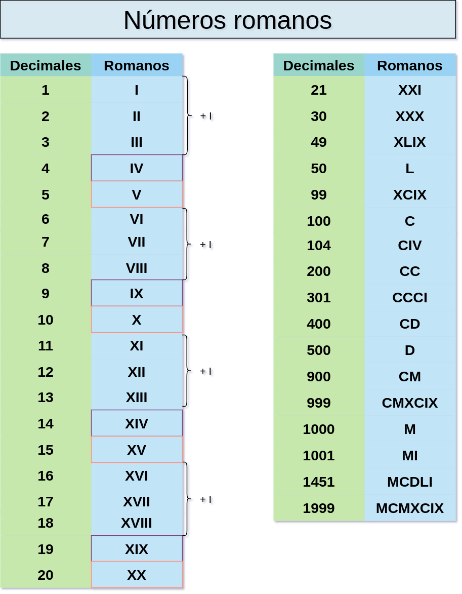

# Goal
To help other to learn how to implement TDD and version control on their own projects.

# Tasks
Write a method `String convert(int)` that takes a number and converts it to the according String representation.

# Hint
This kata lures a lot of people to implement features in the order of the numbers. But do not forget that it’s sometimes easier to start with a general case and add exceptions later.

# Learnings

- [ ] TDD
- [ ] Baby steps
- [ ] Version control

 
## Tools

- [ ] Git
- [ ] Docker
- [ ] Terminal line

## Authors

Emmanuel Valverde [@evrtrabajo](https://www.twitter.com/evrtrabajo)

## Setup
Luis Rovirosa [@luisrovirosa](https://www.twitter.com/luisrovirosa)

Jordi Anguela [@jordianguela](https://www.twitter.com/jordianguela)